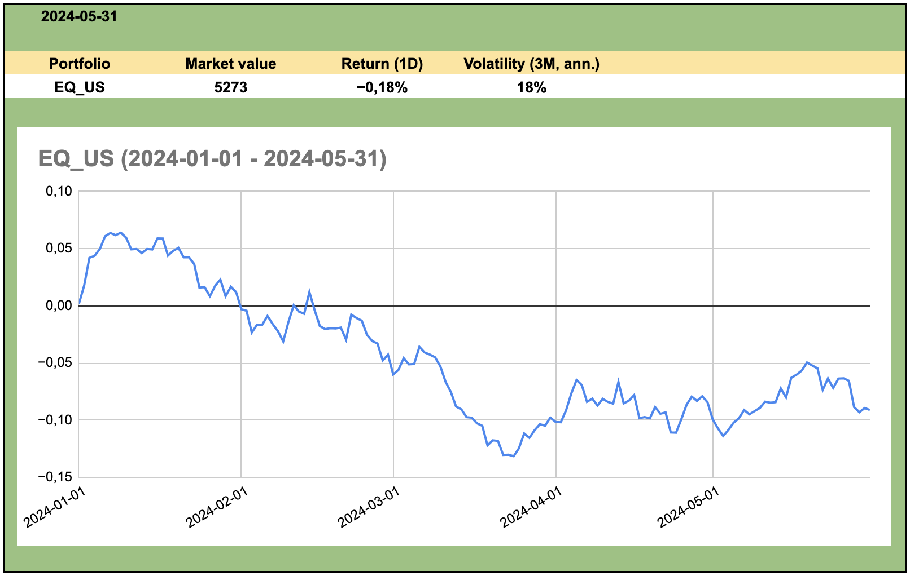

# alecta_case
This repository contains code for Alecta's risk report case.

## How to run the program
Go to the repository root folder in the command line / terminal and execute the script **main.py**.

```python main.py```

The output should be similar to:

```
{
    "portfolio": "EQ_SWE",
    "date_from": "2024-01-01",
    "date_to": "2024-05-31",
    "key_figures": {
        "Market value": 6720.7401765,
        "Return (1D)": -0.014494433767839321,
        "Volatility (3M, ann.)": 0.20471088864334747
    },
    "cumulative_returns": [
        [
            "2024-01-01",
            -0.001685235900000026
        ],
        ...
	]
}
```

## Development environment
For the implementation of this case Python 3.11.4 was used, and it is therefore recommended
to use a Python version >= 3.11.4 to run the script.

For code linting / formatting Microsoft's Black Formatter in VS Code was used.
Some settings which was used in VS Code that affects coding style are:

```
"[python]": {
	"editor.defaultFormatter": "ms-python.black-formatter",
	"editor.formatOnSave": true,
	"editor.insertSpaces": true,
	"files.insertFinalNewline": true,
}
```

There is a VS Code workspace file in the root folder called **alecta_case.code-workspace**.
Opening this workspace in VS Code activates some workspace settings, which hides some
intermediate files generated during running of the program and which are not of interest for development.

Here are the workspace settings:
```
"settings": {
	"files.exclude": {
		"**/*.pyc": true,
		"**/*__pycache__*": true
	}
}
```

### Database 
The program uses a database for keeping track of portfolio holdings, instruments and prices.
The database type used is SQLite and the database file can be found here: **./db/alecta_case_db.db**.

### Unit tests
During development some unit testing was used. These tests can be found in **unit_tests.py**.
The unit tests can be run as follows:

```python unit_tests.py```

### Coding style
This case implementation uses [Google's Python Style Guide](https://google.github.io/styleguide/pyguide.html).
In particular the docstring style uses Google's style guide.

## Structure
The program has the following file tree.

- db (folder)
- modules (folder)
- main.py (file)

The main entry point of the program is **main.py** and should be executed to run the program.
(See "How to run the program" above).

The **db** folder contains the database file.

The **modules** folder contains all the types and APIs used throughout the program and has the following structure:

- modules
    - api
	- helpers
	- risk
	- types

Every folder under **modules** is a package, and they have different responsibilities.

| Package    | Description |
| -------- | ------- |
| api  | Contains API types. In particular it contains the sub-package **db** which defines types for database communication.    |
| helpers | Contains useful and generic objects used throughout the program.     |
| risk    | Contains risk report specific types. In particular it contains **RiskReport**, the type used for generating the report output.    |
| types    | Contains types mapping to the database, providing the model classes for the ORM approach taken in the program.   |

#### The api package
This package defines a class hierarchy of abstract base classes (ABC) in the **db** module.

- **DbAccessor** (abstract)
	- **SQLiteDbAccesssor**

**DbAccessor** defines a common interface that any database server specific implementation must implement.
The type **SQLiteDbAccessor** is a concrete type which targets the SQLite database server.
Using this approach one could switch the underlying database server to for example MSSQL by creating
a **MSSQLDbAccessor** type inheriting from **DbAccessor**.
Code communicating with the database only knows it has a reference to an instance of a type deriving
from **DbAccessor** and knows its public interface. This makes the program more loosely coupled to the database
and as tied to any particular database server.

Instances of the class **RiskDbAccessor** has an attribute referencing an object implementing the
**DbAccessor** interface. **RiskDbAccessor** implements the database communication code which is
specific to the risk report database. It therefore also makes heavy use of the model classes
which can be found under **./modules/types**.

#### The helpers pacakge
Contains some helpful generic functionality.

#### The risk package
This package defines the types which make up the risk report.

- **RiskFigureGenerator**
- **RiskReport**

**RiskFigureGenerator** has an attribute referencing an object of type **RiskDbAccessor**.
It uses this attribute to retrieve and persist data from and to the database as required, in
order for it to calculate the figures which are required by the **RiskReport** type.
The type **RiskFigureGenerator** is therefore the "calculator" of the risk report.

**RiskReport** is a higher level abstraction, which takes an object of type **RiskReportSettings**
and based on that object as the **RiskFigureGenerator** to calculate some key figures, which it can
then present as output.

#### The types package
This package contains all the model classes used by the program. It contains types such as

- **BaseEntity** (abstract)
- **BaseEntityNamed** (abstract)
- **InstrumentType**
- **Instrument** (abstract)
- **Equity**
- **Bond**
- **Portfolio**
- **Position**
- **Price**
- **KeyFigure**
- **KeyFigureValue**
- **KeyFigureRefType**

A few words about the ABC **BaseEntity**: Every object has an id, an id unique among its siblings.
Every type in the ORM model therefore ultimately derives from **BaseEntity**, and its sole purpose
is to provide an **id** attribute, an implementation of **\_\_eq\_\_** which makes value-based equality
use instance type and **id**, and a base implementation of **\_\_str\_\_**, allowing for easier debugging during
testing.

## Risk report
For the purpose of this case, only a few figures are included in the report.

- Market value
- Return (1D)
- Volatility (3M, ann.)

Also, a time series of the cumulative returns is included.
No graphical report has been constructed for this case. Only the input to the report is implemented.
The actual report could be done in a variety of ways, e.g. PowerBI, Tableau, Excel.
An example of how the report could look can be seen in the following picture.



The market value is simply the total value of all the positions in the portfolio for a given date.

The "Return (1D)" figure is the one-day portfolio return (for the last date of the report range), calculated as

$$ r(t) := \text{Return}_{1\text{Day}}(t) := \frac{MV(t)}{MV(t-1)} - 1, $$

where $$ MV(t) := \sum_{i=1}^{n} \text{Position}_{i}(t). $$
That is, a summation of the individual market values of the positions in the portfolio.

**N.B.** For this case, we are simplifying a lot and there are no cashflows. In the presence of cashflows,
and assuming end-of-day timing of cashflows, the return would be defined as

$$ r(t) := \frac{MV(t) - CF(t) - MV(t-1)}{MV(t-1)}.$$

The figure "Volatility (3M, ann.)" represents the standard deviation of the logarithmic portfolio returns, taking
the last 3 months of daily returns as the observations, computing their standard deviation and then
annualizing the result.

$$ \text{Volatility (3M, ann.)}(t) := \sqrt{365} * \sigma(\mathbf{x}(t)), $$

where

$$ \mathbf{x}(t) := (\log(1 + r(t-89)), \log(1 + r(t-88)), ..., \log(1 + r(t-1)), \log(1 + r(t)))^{T} $$

and $\sigma$ computes the standard deviation of a vector.

### Portfolio data
There are 4 portfolios for the purpose of this case. Each portfolio contains the same positions
forever (simplified approach for this case), but the prices of the instruments of those positions vary.

The portfolios and there holdings are:

| Portfolio    | Positions |
| -------- | ------- |
| EQ_US  | 55 shares of Nvidia, 3 shares of Tesla.    |
| EQ_SWE | 75 shares of Volvo.     |
| FI_US    | 6500 notional of T 3.75 2028-06-14.   |
| FI_SWE    | 6500 notional of SGB 3118 2030-07-12.   |

**N.B.** For the purpose of this simplified case different currencies are not considered.
One could make the assumption that all the prices used have already been converted into a common currency.
